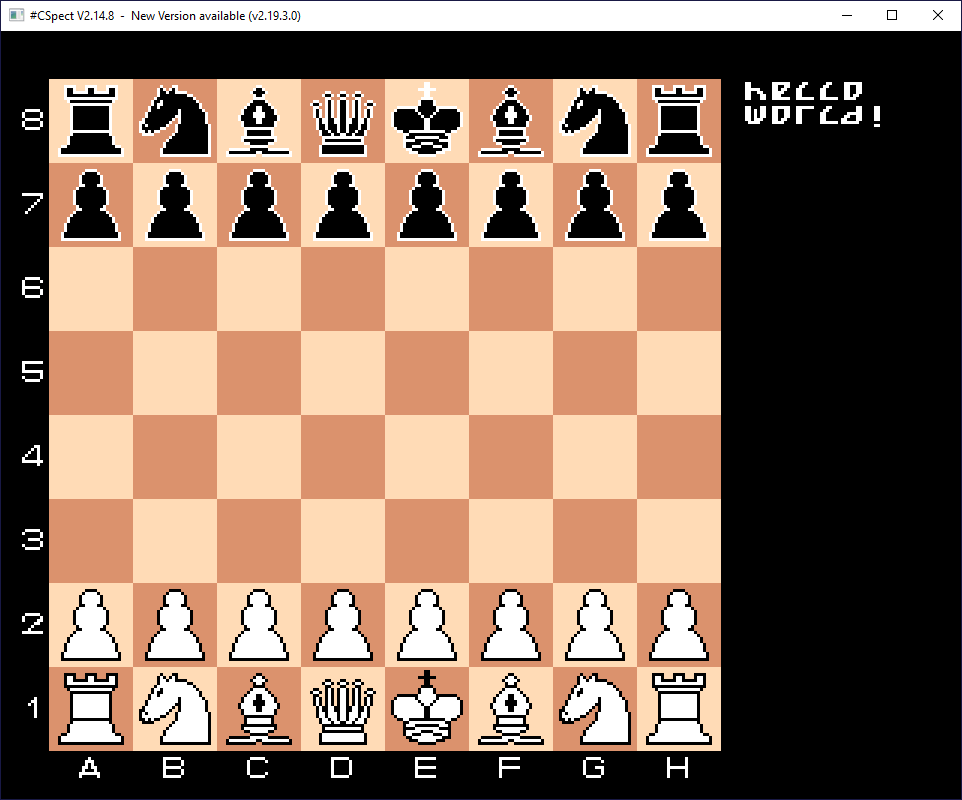

# Chess Demo

Demonstrates relative sprites for the ZX Spectrum Next.

## How to Build

If you want to build the zxnext_chess_demo program yourself, follow the steps below:

1. Install the latest version of [z88dk](https://github.com/z88dk/z88dk) and
a Sinclair ZX Spectrum emulator [CSpect](https://dailly.blogspot.com/) or
[ZEsarUX](https://sourceforge.net/projects/zesarux/).

2. Download the zxnext_chess_demo repository either as a ZIP archive using the
"Clone or download" button at the top of this page or with Git using the
following command:

> git clone https://github.com/headkaze/zxnext_chess_demo.git

3. Go to the zxnext_chess_demo directory and enter the following command:

> make

4. Run the zxnext_chess_demo/bin/zxnext_chess_demo.nex file in your
Sinclair ZX Spectrum emulator.

## Screenshot

## Thanks

- [Sefan Bylund](https://github.com/stefanbylund) for his z88dk examples on which these are based
- [Michael Ware](https://www.rustypixels.uk/) for innumerable help with the Next hardware and z80 asm and graphics in this demo
- [Peter Ped Helcmanovsky](https://github.com/ped7g) for help fixing a bug in this demo

## License

This software is licensed under the terms of the MIT license.
